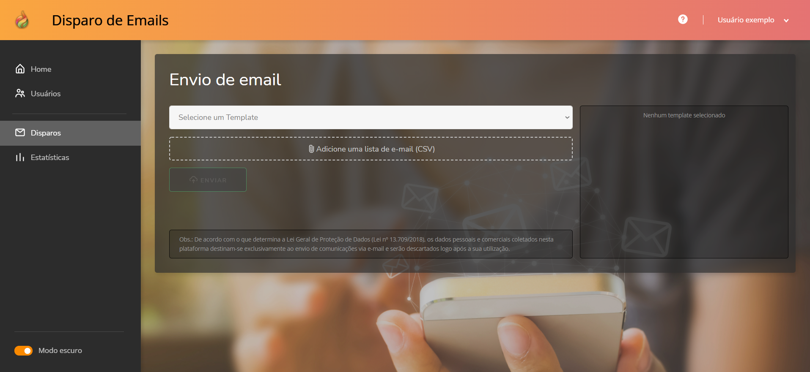
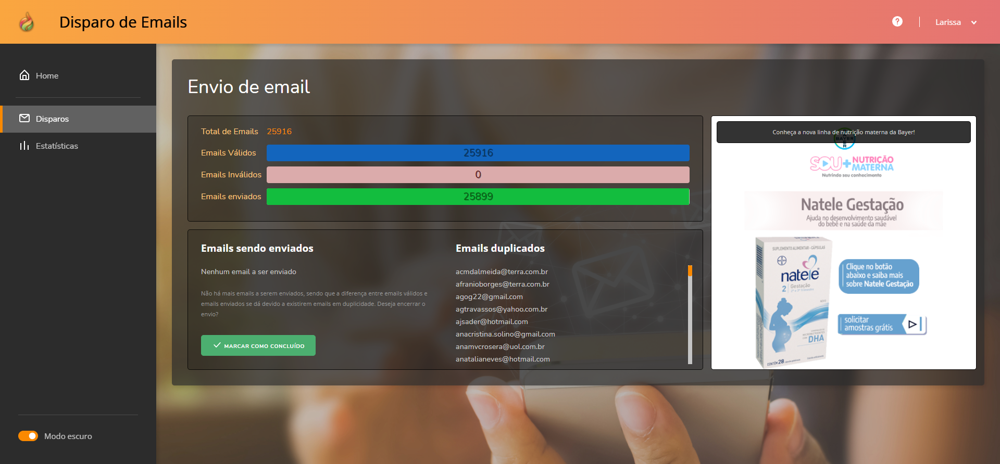
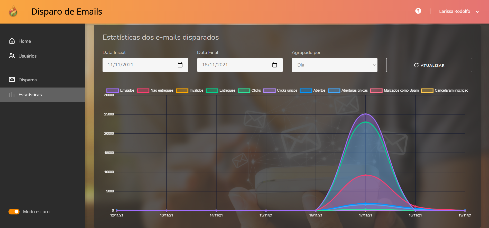

# Manual de uso

> **Obs.:** As figuras de exemplo são do tema escuro. O tema pode ser alterado no botão apropriado na parte inferior do menu lateral.

***

## Usuários

Sendo um usuário **Administrador** será possível controlar os usuários do sistema, delegando funções para cada um.

No botão de incluir (no canto superior direito) você adiciona um novo usuário.

Para editar um usuário, basta clicar no botão de editar do usuário desejado (ícone de lápis). 

> **Obs.:** Uma tela semelhante será aberta ao clicar em **Perfil** no menu do usuário logado no canto superior direito da tela.

***

## Disparos de e-mails

- **Selecione um template**: Escolha o template desejado pra fazer o disparo.
- **Adicione uma lista de email CSV**: Selecione o arquivo csv com a relação de e-mails a serem enviados.

Assim que selecionar o template desejado, poderá ver o preview como mostra a imagem abaixo:

Clicando no template, conseguirá vê-lo ampliado.

Assim que um disparo for feito, ficará como na tela abaixo, mostrando as quantidades de e-mails enviados, válidos e inválidos:

Também aparecerá uma determinada lista de e-mails sendo enviados e e-mails que estão duplicados, ou seja, que não serão enviados novamente. Por isso é possível que o número de e-mails válidos seja maior do que o número de e-mails enviados.

## Estatísticas

Nessa tela são fornecidas todas as informações sobre os disparos através do gráfico abaixo:

Poderá filtrar por data e tipo de resposta do e-mail, se foi enviado ou não, se foi lido e etc.

- **Enviados** - Total de emails que foram processados para envio.
- **Não enviados** - O número de e-mails que não puderam ser entregues ou com endereço de e-mail mal formado ou cujo provedor de e-mail relatou o endereço como inválido.
- **Enviados**- O número de e-mails que a ferramenta conseguiu confirmar que foram realmente entregues a um destinatário.
- **Cliques** - O número de links que foram clicados em seus e-mails.
- **Cliques únicos** - O número de destinatários exclusivos que clicaram em links em seus e-mails.
- **Abertos** - O número total de vezes que seus e-mails foram abertos por destinatários.
- **Aberturas únicas** - O número de destinatários exclusivos que abriram seus e-mails.
- **Spam** - O número de emails que cairam em spam ou que foram marcados como spam.
- **Cancelaram inscrição** - O número de destinatários que cancelaram a assinatura de seus e-mails.

